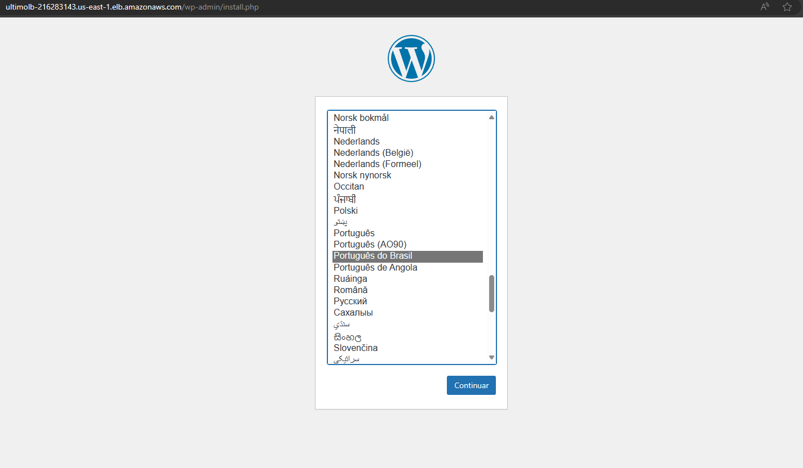

<h1 align="center">DOCUMENTAÇÃO Segunda atividade de Linux DevSecOps</h1>

<h1>Atividade - AWS - Docker</h1>

<h1>Requisitos</h1>
    <ul>
        <li>Instalação e configuração do DOCKER ou CONTAINERD no host EC2;</li>
        <li>Efetuar Deploy de uma aplicação Wordpress com: container de aplicação RDS database Mysql;</li>
        <li>Configuração da utilização do serviço EFS AWS para estáticos do container de aplicação Wordpress;</li>
        <li>Configuração do serviço de Load Balancer AWS para a aplicação Wordpress.</li>
    </ul>

<h1>Pontos de atenção:</h1>
    <ul>
        <li>Não utilizar ip público para saída do serviços WP (Evitem publicar o serviço WP via IP Público);</li>
        <li>Sugestão para o tráfego de internet sair pelo LB (Load Balancer Classic);</li>
        <li>Pastas públicas e estáticos do wordpress sugestão de utilizar o EFS (Elastic File Sistem);</li>
        <li>Fica a critério de cada integrante (ou dupla) usar Dockerfile ou Dockercompose;</li>
        <li>Necessário demonstrar a aplicação wordpress funcionando (tela de login);</li>
        <li>Aplicação Wordpress precisa estar rodando na porta 80 ou 8080;</li>
        <li>Utilizar repositório git para versionamento;</li>
        <li>Criar documentação;</li>
    </ul>

<h1>Criação da VPC</h1>
    <li>Acesse <a href="https://us-east-1.console.aws.amazon.com/vpcconsole/home?region=us-east-1#CreateVpc:createMode=vpcOnly"> este link </a></li>
    <li>Selecione as seguintes configurações</li>
    <li></li>
    <li></li>

<h1>Configuração dos security groups</h1>
    <li>EFS-SG - Grupo de segurança da EFS</li>
       
    <li>EC2-Instance-SG - Grupo de segurança das instancias EC2</li>
        
    <li>EC2-SG - Grupo de segurança do Endpoint</li>
        
    <li>LB-SG - Grupo de segurança do load balancer</li>
        
    <li>RDS-SG - Grupo de segurança da RDS</li>
        

<h1>Configuração EFS</h1>
    <li>Acesse <a src="https://us-east-1.console.aws.amazon.com/efs/home?region=us-east-1#/file-systems"> este link</a></li>
    <li>Clique em create filesystem</li>
    <li>Clique em personalizar</li>
    <li>Mude o nome do filesystem e clique em proximo</li>
    <li>Selecione a VPC do projeto</li>
    <li>Clique em next</li>
    <li>Revise e clique em criar</li>
    <li>Para a montagem do EFS foi utilizado os seguintes comandos (Adicionados ao user_data)</li>
    <pre><code>
        sudo mkdir /efs
        sudo mount -t nfs4 -o nfsvers=4.1 fs-08a3a7ff4f3066d11.efs.us-east-1.amazonaws.com:/ efs
        sudo echo "fs-08a3a7ff4f3066d11.efs.us-east-1.amazonaws.com:/ /efs nfs4 nfsvers=4.1 0 0" >> /etc/fstab
        sudo mkdir /efs/wordpress
    </code></pre>

<h1>Criação do launch template</h1>
    <li>A criação do template segue o mesmo padrão da criação de instancia porem nesse caso adicionamos o script no user_data</li>
    
    

<h1>Instalação do docker</h1>
    <li>Rode o comando yum com o pacote do docker</li>
        <pre><code>sudo yum install docker -y</code></pre>
    <li>rode um start e habilite o serviço do docker para iniciar no boot</li>
        <pre><code>sudo systemctl start docker</code></pre>
        <pre><code>sudo systemctl enable docker</code></pre>
    <li>Adicione o usuário ec2_user ao grupo docker</li>
        <pre><code>sudo usermod -aG docker ec2-user</code></pre>
<h1>Instalação do compose</h1>
    <li>Baixe o compose do github do docker</li>
        <pre><code>sudo curl -L "https://github.com/docker/compose/releases/latest/download/docker-compose-$(uname -s)-$(uname -m)" -o /usr/local/bin/docker-compose</code></pre>
        <li>E coloque em modo de execução</li>
        <pre><code>sudo chmod +x /usr/local/bin/docker-compose</code></pre>
<h1>Load Balancer / Auto Scaling</h1>
    <li>Configuração de listener do Load Balancer</li>
    
    <li>Configuração de rede e subnet</li>
        
    <li>Mapa de recursos do LB</li>
        
    <li>Grupo de segurança do Load Balancer</li>
        
<h3>Auto Scaling</h3>
    <li>Configuração geral do Auto Scaling</li>
    
    <li>Configuração de gerenciamento de instancia.</li>
    
    
<h1>Aplicação Wordpress</h1>
    <li>Tela inicial de configuração do WP</li>
    
    <li>Criação de conta administrativa</li>
    
    <li>Tela de login com as credenciais criadas</li>
    
    <li>Painel do WP apos logado</li>
    