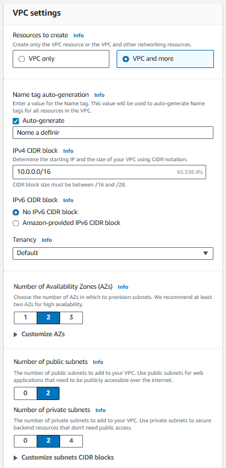

<h1 align="center">DOCUMENTAÇÃO Segunda atividade de Linux DevSecOps</h1>

<h2>Atividade - AWS - Docker</h2>

<h2>Requisitos</h2>
    <ul>
        <li>Instalação e configuração do DOCKER ou CONTAINERD no host EC2;</li>
        <li>Efetuar Deploy de uma aplicação Wordpress com: container de aplicação RDS database Mysql;</li>
        <li>Configuração da utilização do serviço EFS AWS para estáticos do container de aplicação Wordpress;</li>
        <li>Configuração do serviço de Load Balancer AWS para a aplicação Wordpress.</li>
    </ul>

<h2>Pontos de atenção:</h2>
    <ul>
        <li>Não utilizar ip público para saída do serviços WP (Evitem publicar o serviço WP via IP Público);</li>
        <li>Sugestão para o tráfego de internet sair pelo LB (Load Balancer Classic);</li>
        <li>Pastas públicas e estáticos do wordpress sugestão de utilizar o EFS (Elastic File Sistem);</li>
        <li>Fica a critério de cada integrante (ou dupla) usar Dockerfile ou Dockercompose;</li>
        <li>Necessário demonstrar a aplicação wordpress funcionando (tela de login);</li>
        <li>Aplicação Wordpress precisa estar rodando na porta 80 ou 8080;</li>
        <li>Utilizar repositório git para versionamento;</li>
        <li>Criar documentação;</li>
    </ul>

<h2>Criação da VPC</h2>
    <li>Acesse <a href="https://us-east-1.console.aws.amazon.com/vpcconsole/home?region=us-east-1#CreateVpc:createMode=vpcOnly"> este link </a></li>
    <li>Selecione as seguintes configurações</li>
    <li></li>
    <li></li>

<h2>Configuração dos security groups</h2>
    <li>EFS-SG - Grupo de segurança da EFS</li>
       
    <li>EC2-Instance-SG - Grupo de segurança das instancias EC2</li>
        
    <li>EC2-SG - Grupo de segurança do Endpoint</li>
        
    <li>LB-SG - Grupo de segurança do load balancer</li>
        
    <li>RDS-SG - Grupo de segurança da RDS</li>
        

<h2>Criação da VPC</h2>
